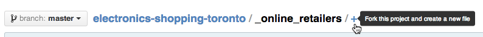
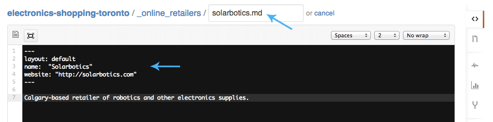
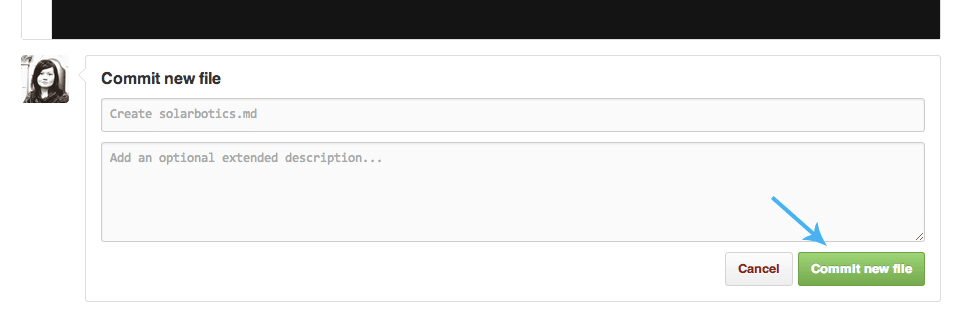
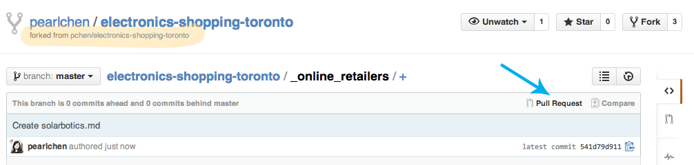
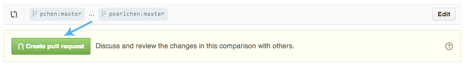
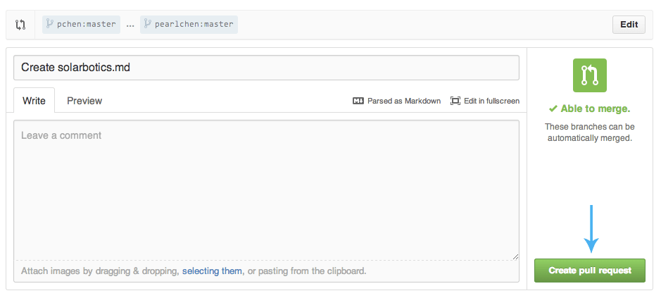

Where to buy electronics in Toronto?
------------------------------------

A listing of local and online electronics &amp; hardware retailers specifically for Toronto-area makers.

## About

This site was put together by Pearl Chen to make sure that you can find hobby electronics supplies in Toronto.

## Improvement roadmap

* [ ] Add CI to automatically deploy contents of **_site** folder to **gh-pages** branch
* [ ] Add ability to sort listings in non-alphabetical ways
* [ ] Rewrite some content so be less opinionated and more factual
* [ ] Make it look more spiffy

## Want to contribute?

The retailers listing is part of a [Github repo](https://github.com/pchen/electronics-shopping-toronto) and I accept pull requests (PR) for updates and new listings. 

For minor changes, go ahead and submit the PR. For more major ones, please open up a [Github issue](https://github.com/pchen/electronics-shopping-toronto/issues) for discussion.

Already familiar with Git and pull requests? Cool, keep reading.

If you're not, you might find it easier to [Submit the PR via Github](#submit-the-pr-via-github)

### Preview site locally

[Install Jekyll](http://jekyllrb.com/docs/installation/) (requires Ruby):

```
$ gem install jekyll
```

Run the Jekyll server:

```
$ jekyll serve --watch
```

Go to **http://localhost:4000**.


### To add a Toronto or GTA retailer

1. Create a new Markdown (.md) file in either the **_toronto_retailers** or **_toronto_hardware_misc** folder. Give it a file name representing the store's name (all in lowercase, separate spaces with an underscore). If a store has several locations, consider making an entry for each location so there's a snazzy Google Map for each one. 

2. All local retailers have this format for their template:

```
---
layout: default
name:  "STORE NAME"
website: "http://STOREWEBSITE.com"
address: "STORE ADDRESS, Toronto, ON"
phone: "(STORE) PHONE NUMBER"
---

BLURB ABOUT THE STORE GOES HERE.

IT CAN BE MULTIPLE PARAGRAPHS BUT BEST TO BE SHORT & SWEET. (AND NO... IT SHOULDN'T BE WRITTEN IN ALL CAPS.)
```

If a retailer doesn't have a website, just remove that line.

### To add an online retailer

1. Create a new Markdown (.md) file in the **_online_retailers** folder. Give it a file name representing the store's name (all in lowercase, separate spaces with an underscore).

2. All online retailers have this format for their template:

```
---
layout: default
name:  "STORE NAME"
website: "http://STOREWEBSITE.com"
---

BLURB ABOUT THE STORE GOES HERE.

IT CAN BE MULTIPLE PARAGRAPHS BUT BEST TO BE SHORT & SWEET. (AND NO... IT SHOULDN'T BE WRITTEN IN ALL CAPS.)
```

### Submit the PR via Github

If you don't want to set up Git, Jekyll, or any of that funny business on your computer, you can actually edit and submit Markdown files directly via Github.

To submit a new retailer, choose which folder it should go in and click **+** (the plus sign) in the file path:



On this new page, give it a file name representing the store's name and store description. See the templates in the above sections for the format of either a local retailer or an online retailer.



When you're done, scroll down to the bottom and click **Commit new file**:



You'll end up on your branch of the electronics-shopping-toronto repository so now you need to submit a pull request to get your branch into my branch. 

So go ahead and click **Pull Request**:



Then click **Create pull request**:



And (three's a charm!) click on **Create pull request** again:



I'll get notified of it and can merge it in on my end.

**Thanks for contributing!**
